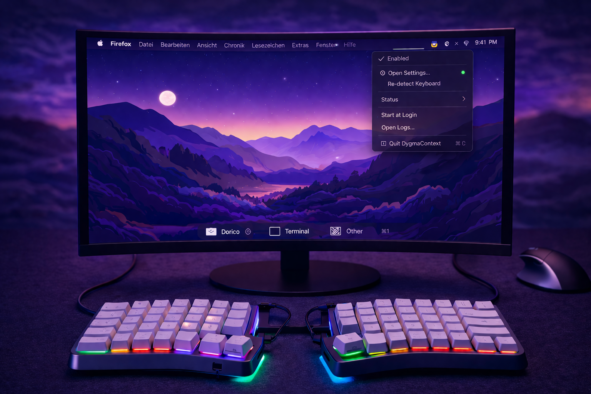
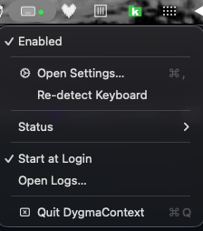
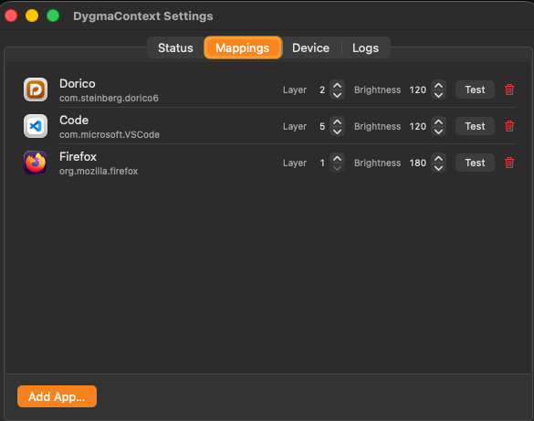
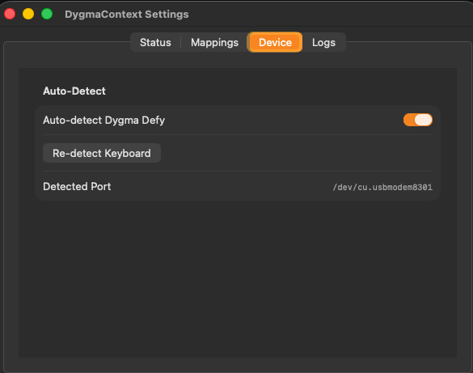

# DygmaContextSwitcher

  

A native macOS menu bar app that automatically switches your Dygma Defy keyboard layer based on the active foreground application — silently, within milliseconds, without any manual input.

Switch to Dorico and your keyboard moves to your music layer. Switch to Terminal and it moves to your coding layer. Switch back to your browser and it returns to default. You never touch the keyboard layers manually again.

---

## ✨ Quick Start

1. Install the app  
2. Connect keyboard via USB  
3. Define mappings  
4. Done  

---

## 🖼️ Interface Overview

### Menu Bar

### App → Profile Mapping

### Device View

---

## 🎯 Philosophy

No friction.  
No manual switching.  
Just context.
